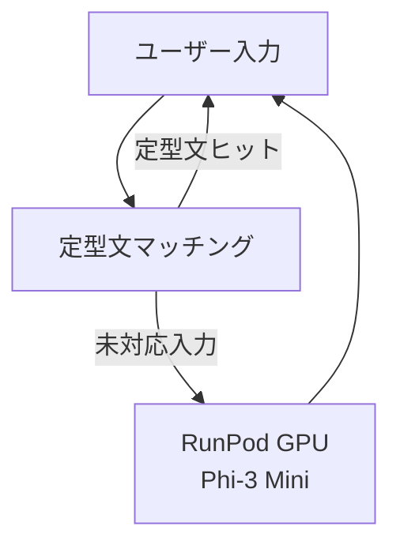

# Snack Misaki — Architecture

## アーキテクチャ概要
Snack Misaki は、フロントエンド・バックエンド・LLM の 3 層構成で設計されています。
フロントエンドがユーザー属性（無料/有料/VIP）を判定し、RunPod 上の 2 系統エンドポイント（Phi-3 Mini / Mistral 7B）と外部 LLM API へ振り分けます。
3 段階のステージを通じて、無料→有料→VIP と段階的に高性能モデルへ拡張します。

---

## 全体構成図

```mermaid
flowchart TD

subgraph Frontend["Frontend: React + TypeScript"]
  F1[ユーザー入力]
  F2[定型文マッチング]
  F3[ログイン/属性判定\nルーティング]
end

subgraph Backend["Backend: RunPod Serverless (GPU) + Python"]
  B1[RunPod エンドポイント\nPhi-3 Mini\n(無料ユーザー向け)]
  B2[RunPod エンドポイント\nMistral 7B\n(有料ユーザー向け)]
end

subgraph External["External LLM API"]
  B3[Claude / GPT API\n(VIP 向け)]
end

F1 --> F2
F2 -->|定型文ヒット| F2
F2 -->|未対応入力| F3
F3 -->|無料| B1
F3 -->|有料 (ログイン)| B2
F3 -->|VIP (ログイン)| B3
B1 --> F1
B2 --> F1
B3 --> F1
```

---

## ステージごとのアーキテクチャ

### Stage 1: フロントエンド → Phi-3 Mini
- **対象**: フロントエンド + RunPod (Phi-3 Mini)
- **内容**: 未ログインの無料ユーザーを RunPod Serverless (GPU) 上の Phi-3 Mini エンドポイントへ送る
- **目的**: 低コストで LLM 応答を提供しつつ、UI/ルーティングの骨格を確立



---

### Stage 2: フロントエンド（ログイン） → Mistral 7B
- **対象**: フロントエンド + RunPod (Phi-3 Mini / Mistral 7B)
- **内容**:
  - ログイン導線を設け、有料ユーザーは Mistral 7B 専用エンドポイントにルーティング
  - 無料ユーザーは引き続き Phi-3 Mini を利用
- **目的**: 有料ユーザー向けに高性能モデルを提供し、無料層とのコストバランスを保持

```mermaid
flowchart TD
F1[ユーザー入力] --> F2[定型文マッチング]
F2 -->|定型文ヒット| F1
F2 -->|未対応入力 (無料)| B1[RunPod GPU\nPhi-3 Mini]
F2 -->|未対応入力 (有料)| B2[RunPod GPU\nMistral 7B]
B1 --> F1
B2 --> F1
```

---

### Stage 3: フロントエンド（ログイン） → 外部 LLM API
- **対象**: フロントエンド + RunPod + 外部 LLM
- **内容**:  
  - 有料/無料の経路に加え、VIP ユーザーを Claude / GPT など外部 API にルーティング
  - RunPod 上のモデルで得た知見を外部 LLM へのプロンプト拡張に活用
- **目的**: VIP 向けに最も高精度な応答を提供し、上位プランを成立させる

```mermaid
flowchart TD
F1[ユーザー入力] --> F2[定型文マッチング]
F2 -->|定型文ヒット| F1
F2 -->|未対応入力 (無料)| B1[RunPod GPU\nPhi-3 Mini]
F2 -->|未対応入力 (有料)| B2[RunPod GPU\nMistral 7B]
F2 -->|未対応入力 (VIP)| B3[外部 LLM API\nClaude / GPT]
B1 --> F1
B2 --> F1
B3 --> F1
```

---

## コンポーネントの役割
- **フロントエンド**: ユーザー入力、定型文レスポンス UI、ログイン状態に基づくルーティング
- **バックエンド**: RunPod Serverless (GPU) + Python、Phi-3 Mini / Mistral 7B の 2 系統エンドポイント
- **外部 API**: Claude / GPT など VIP 向けの高精度応答を提供
