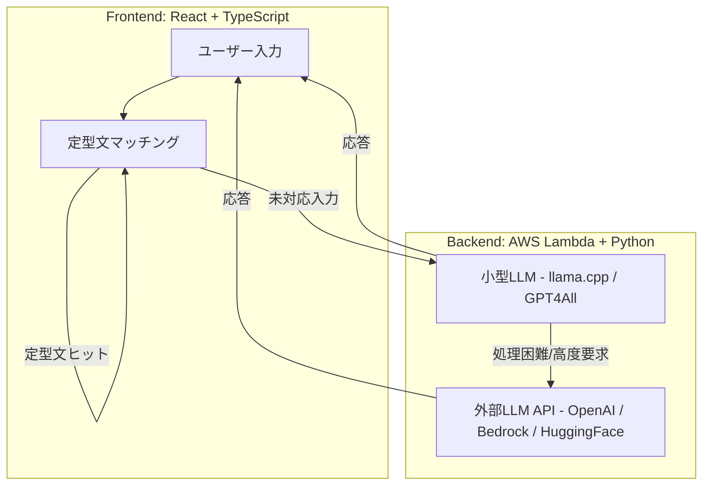
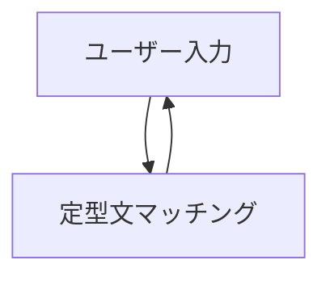
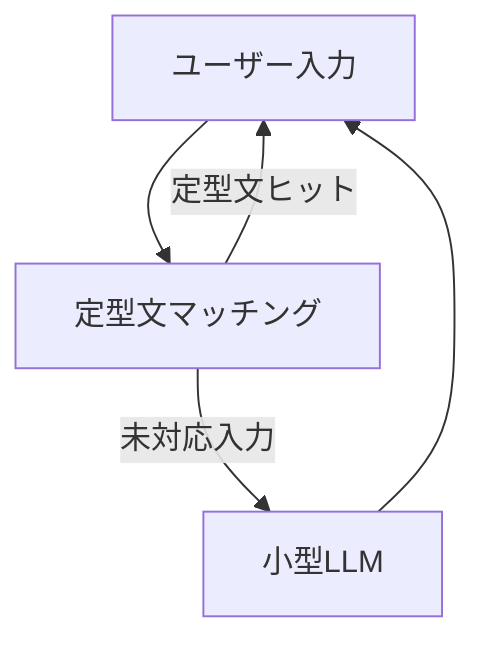
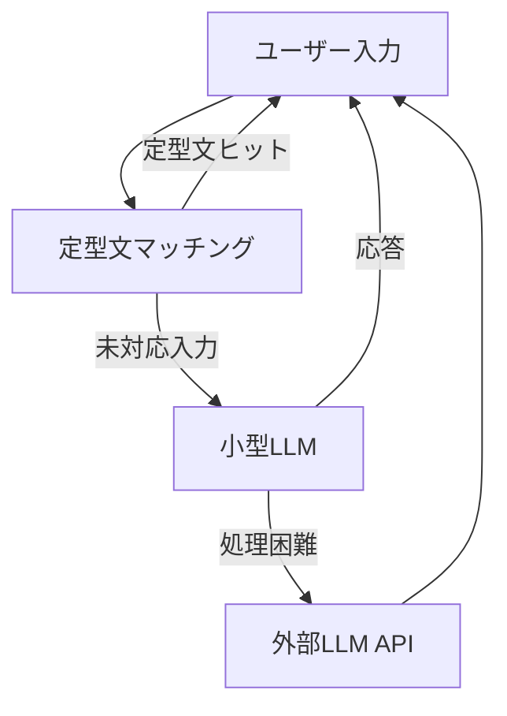

# Snack Misaki — Architecture

## アーキテクチャ概要
Snack Misaki は、フロントエンド・バックエンド・LLM の 3 層構成で設計されています。  
進化型の 3 段階ステージを通して、軽量 PoC から高度な外部 LLM 連携まで拡張可能です。

---

## 全体構成図

---

## ステージごとのアーキテクチャ

### Stage 1: フロントエンドのみ
- **対象**: フロントエンド
- **内容**: React による定型文レスポンス UI
- **目的**: まずはシンプルな PoC として対話体験を確認

---

### Stage 2: フロントエンド + バックエンド
- **対象**: フロントエンド + バックエンド
- **内容**:  
  - フロントエンドは Stage 1 を継続利用  
  - バックエンド (Lambda/Python) を追加し、小型 LLM を呼び出す  
- **目的**: 定型文で対応できない質問に小型 LLM で応答

---

### Stage 3: 外部 LLM API 連携
- **対象**: バックエンド中心
- **内容**:  
  - フロントエンドは Stage 1/2 を継続利用  
  - バックエンドに外部 LLM API を統合し、小型 LLM で難しい質問は外部にエスカレーション  
- **目的**: 高度な応答を実現し、本格運用に対応可能

---

## コンポーネントの役割
- **フロントエンド**: ユーザー入力、定型文レスポンス UI
- **バックエンド**: Lambda + Python、小型 LLM 呼び出し、外部 API 連携
- **外部 API**: 高度な質問や長文応答をサポート

