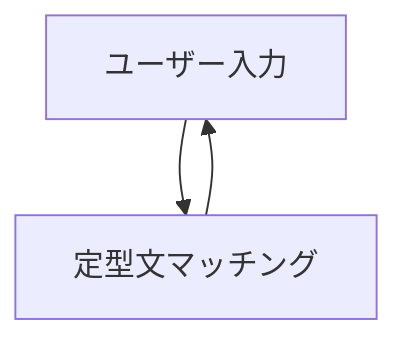
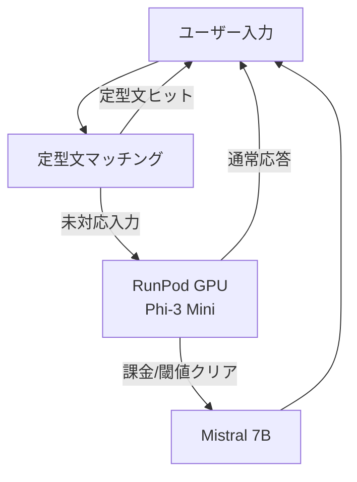
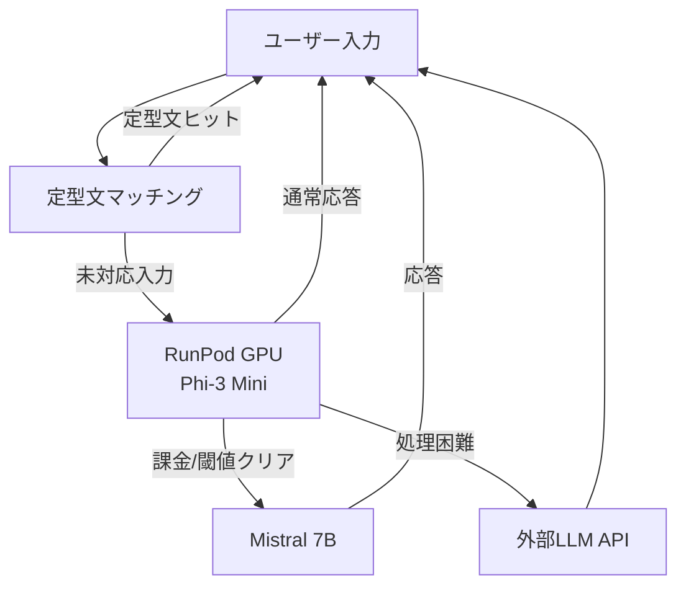

# Snack Misaki — Architecture

## アーキテクチャ概要
Snack Misaki は、フロントエンド・バックエンド・LLM の 3 層構成で設計されています。
進化型の 3 段階ステージを通して、軽量 PoC から RunPod Serverless (GPU) を使った推論、さらに高度な外部 LLM 連携まで拡張可能です。

---

## 全体構成図

```mermaid
flowchart TD

subgraph Frontend["Frontend: React + TypeScript"]
  F1[ユーザー入力]
  F2[定型文マッチング]
end

subgraph Backend["Backend: RunPod Serverless (GPU) + Python"]
  B1[RunPod上の小型LLM - Phi-3 Mini]
  B2[RunPod上のMistral 7B\n(課金/条件クリア時に切替)]
  B3[外部LLM API - OpenAI / Bedrock / HuggingFace]
end

F1 --> F2
F2 -->|定型文ヒット| F2
F2 -->|未対応入力| B1
B1 -->|通常応答| F1
B1 -->|課金/閾値クリア| B2
B2 -->|応答| F1
B1 -->|処理困難/高度要求| B3
B3 -->|応答| F1
```

---

## ステージごとのアーキテクチャ

### Stage 1: フロントエンドのみ
- **対象**: フロントエンド
- **内容**: React による定型文レスポンス UI
- **目的**: まずはシンプルな PoC として対話体験を確認



---

### Stage 2: フロントエンド + RunPod サーバーレス GPU
- **対象**: フロントエンド + バックエンド
- **内容**:
  - フロントエンドは Stage 1 を継続利用
  - バックエンドを RunPod Serverless (GPU, Python) に移行し、Phi-3 Mini を常駐させる
  - 課金/利用条件を満たすユーザーは Mistral 7B に動的切替して返答
- **目的**: 未対応入力を低コスト GPU 環境で処理し、条件付きでモデルをアップグレード



---

### Stage 3: 外部 LLM API 連携
- **対象**: バックエンド中心
- **内容**:  
  - フロントエンドは Stage 1/2 を継続利用
  - バックエンドは RunPod Serverless をベースに、難しい質問は外部 LLM API にエスカレーション
- **目的**: 高度な応答を実現し、本格運用に対応可能



---

## コンポーネントの役割
- **フロントエンド**: ユーザー入力、定型文レスポンス UI
- **バックエンド**: RunPod Serverless (GPU) + Python、小型 LLM 呼び出し、条件に応じた Mistral 7B 切替、外部 API 連携
- **外部 API**: 高度な質問や長文応答をサポート

