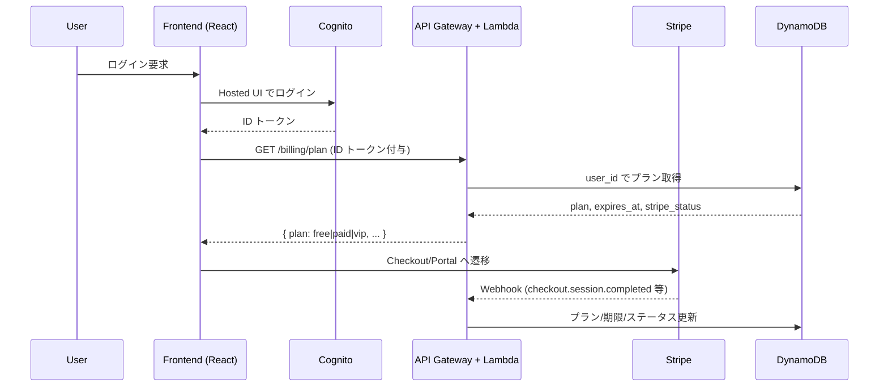

# Snack Misaki — Auth/Billing Backend

## 目的と範囲
Snack Misaki の認証/決済バックエンドは **Cognito + API Gateway + Lambda + DynamoDB + Stripe** を用いた薄い API 群です。  
フロントエンドが **ログイン → プラン照会 → 推論エンドポイント選択** を行うための最小限のデータを返却し、推論系（RunPod / 外部 LLM）とは別ドメイン・別 URL で運用します。

---

## コンポーネント
- **Cognito**: Hosted UI でログインし、ID トークンを発行
- **API Gateway**: `/billing/*` や `/webhook/*` を公開。Cognito オーソライザーで ID トークンを検証
- **Lambda (Python)**:
  - `plan-handler`: DynamoDB からプランを取得し返却
  - `stripe-webhook-handler`: Stripe のイベントを受信し DynamoDB を更新
- **DynamoDB**: `user_id` をキーにプラン/ステータスを保存
- **Stripe**: Checkout / Customer Portal / Webhook を提供し、支払い・サブスク情報のソースとなる

---

## データフロー


---

## API デザイン
### GET `/billing/plan`
- **認可**: Cognito オーソライザー（ID トークン必須）
- **役割**: DynamoDB の最新レコードを返却し、フロントエンドが推論先を決定する
- **レスポンス例**
```json
{
  "user_id": "cognito-sub",
  "plan": "paid",
  "stripe_status": "active",
  "expires_at": "2024-12-01T00:00:00Z",
  "updated_at": "2024-10-10T12:00:00Z"
}
```
- **HTTP 404**: レコードなしの場合は `plan: "free"` と同義で扱う実装でもよい（UI 側でデフォルトを free とする）

### POST `/webhook/stripe`
- **認可**: Stripe-Signature ヘッダー検証必須。Cognito 認証は不要
- **役割**: Stripe イベントを受信し、DynamoDB を更新する
- **対応イベントの例**
  - `checkout.session.completed`: `plan`, `stripe_status`, `expires_at` を更新
  - `invoice.payment_failed` / `customer.subscription.deleted`: `stripe_status` を `past_due` / `canceled` に更新
- **冪等性**: `event_id` を DynamoDB のサブキーに保持して重複処理を防止

---

## DynamoDB スキーマ例
- **テーブル名**: `snack_misaki_users`
- **キー**: `user_id` (Partition Key)
- **属性**
  - `plan`: `free | paid | vip`
  - `stripe_status`: `active | past_due | canceled | trialing`
  - `expires_at`: ISO8601
  - `updated_at`: ISO8601
  - `last_event_id`: Stripe イベントの ID（冪等性用）
- **TTL**: `expires_at` を TTL に設定し、期限切れのレコードを自動削除可能

---

## Stripe 連携
- **Checkout**: プラン変更/初回購入は Checkout へ遷移。成功時 Webhook で DynamoDB を更新
- **Customer Portal**: 解約/プラン変更は Portal へ遷移。`return_url` はフロントエンドのドメインに固定
- **価格 ID 管理**: `STRIPE_PRICE_FREE/PAID/VIP` のように環境変数で保持し、Lambda から参照

---

## 運用・セキュリティ
- **キー管理**: `STRIPE_WEBHOOK_SECRET` を SSM / Secrets Manager で管理し、Lambda に注入
- **監視**: CloudWatch Logs + メトリクスアラーム（4xx/5xx 増加、Webhook 検証失敗）
- **リトライ対応**: Stripe Webhook は再送されるため、`last_event_id` での冪等性チェックを徹底
- **ローカル検証**: `stripe listen --forward-to http://localhost:3000/webhook/stripe` でエンドポイントを確認可能

---

## フロントエンド連携のポイント
- プランはチャット送信直前に再取得し、キャッシュが古い場合は `/billing/plan` を再問い合わせる
- プランに応じて **RunPod (Phi-3/Mistral) / 外部 LLM** へ送信先を切り替える
- 認証/決済 API と推論エンドポイントは必ず別ドメインとして扱い、CORS 設定はそれぞれで管理する
